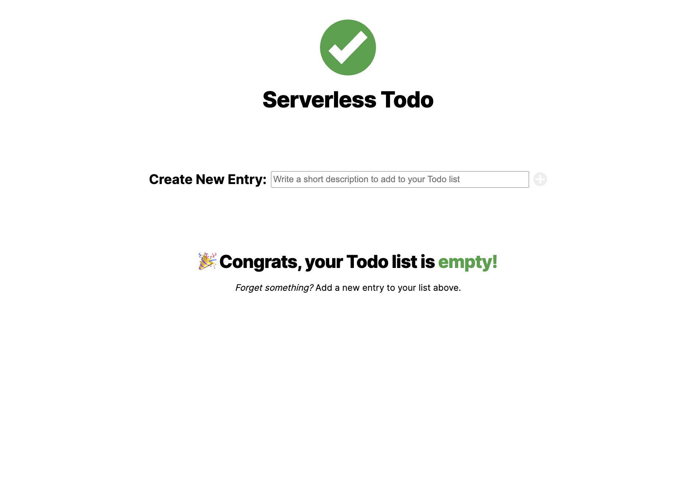
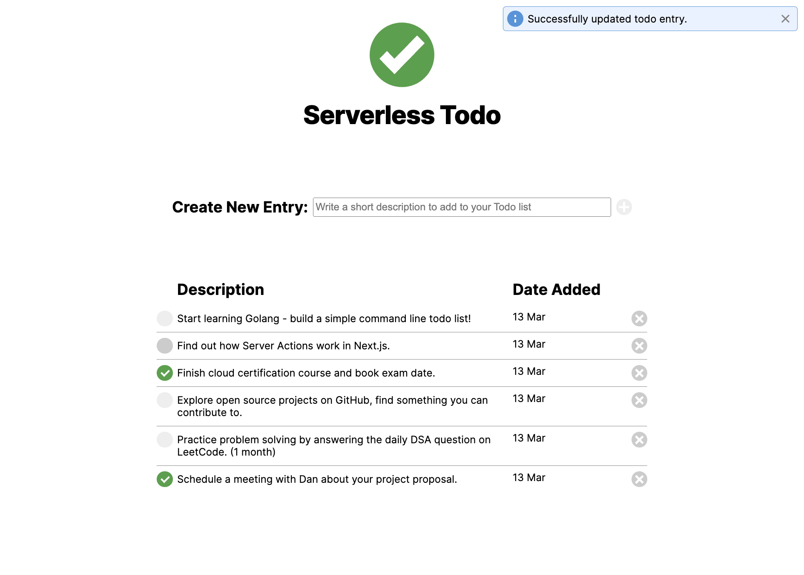
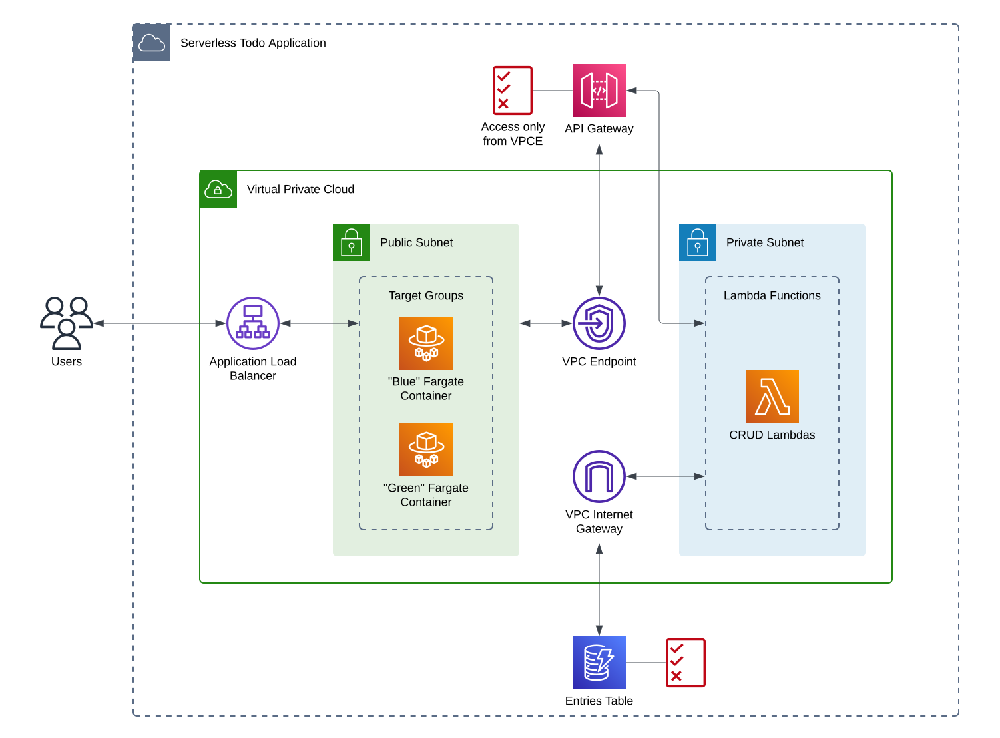
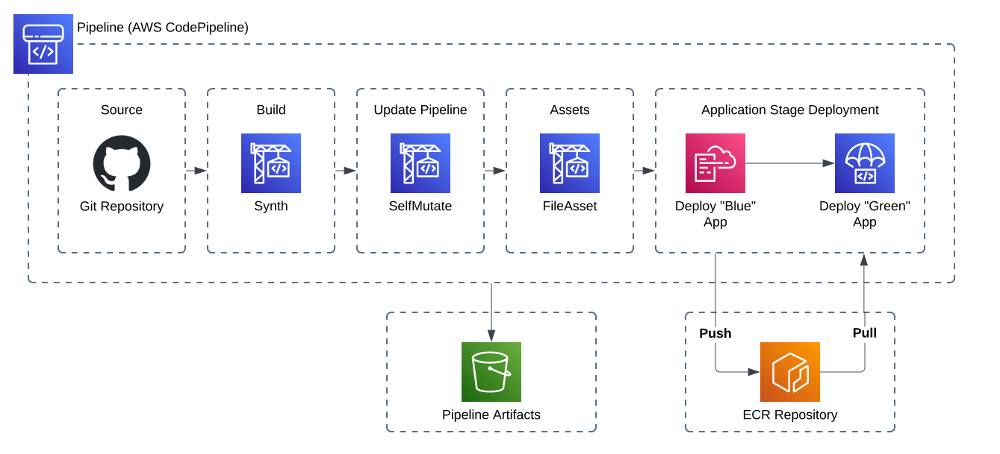

# serverless-todo

<p align="center">
  <picture>
    <source media="(prefers-color-scheme: dark)" srcset="./docs/assets/logos/serverless_todo_logo_label_dark.svg">
    
  </picture>
</p>

Serverless Todo is a simple web app for keeping track of the things you have... _to do_. Built entirely for the purpose of getting practice with Next.js, AWS CDK, Python, and a few DevOps / Systems Design concepts here and there.

> Is it perfect? Definitely not! Tell me what I got right, what I got wrong - let's start a discussion!

---

## Table of Contents

- [Overview](#overview)
  - [Architecture](#architecture)
- [CICD](#cicd)
- [Ephemeral Environments](#ephemeral-environments)
- [Future Work](#future-work)

---

## Overview

Does what it says on the tin! Serverless Todo is a to-do list, built using AWS Serverless resources. Add, mark as complete, and delete entries from your easy to read list as you see fit.

|                                                                                        |                                                                                             |
| -------------------------------------------------------------------------------------- | ------------------------------------------------------------------------------------------- |
|  |  |

### Architecture



- A public load balancer routes traffic from the internet to one of two target groups deployed in a public subnet.
- Each target group consists of up to 1 Fargate task running our web application.
- The Fargate containers can send requests to the backend services via a private API Gateway REST API, traffic is routed through a VPC endpoint to accomplish this.
- The REST API has Lambda integrations in place for the GET, POST, PUT, and DELETE verbs. Each interacting in a logical way with the DynamoDB table that stores our list entries.
- Our CRUD Lambda functions are deployed in a private subnet, meaning traffic must be routed via a VPC internet gateway for it to reach the DynamoDB table.

## CICD

A CICD pipeline has been built using [CDK Pipelines](https://docs.aws.amazon.com/cdk/v2/guide/cdk_pipeline.html) and should be used to handle all deployments. Due to the scope of the project, automated deployments are currently made to only one AWS environment.



Please read the [Serverless Todo CICD Pipeline](/pipeline/README.md) document for information on usage and how to get started with automation.

## Ephemeral Environments

During development, it may be helpful to spin up ephemeral environments; short-lived copies of the application stack that correspond to the feature being worked on.

A shell script has been written for this exact purpose! It acts as a wrapper to the `cdk deploy` command, meaning you can pass in the same command line options. Try `./scripts/deploy_ephemeral --hotswap`, or use a non-default AWS account using the `--profile` option!

Basic usage of the [deploy_ephemeral](./scripts/deploy_ephemeral) script looks like:

```bash
# Checkout a new branch e.g.
git checkout -B feature/user-accounts
# From the project root, run:
./scripts/deploy_ephemeral
```

This will synthesise new stateful and stateless stacks, creating AWS resources with the branch name added on as a prefix, e.g. `feature-user-accountsEntriesTable`.

## Future Work

- Implement user accounts - let's keep the _Serverless_ theme going and use AWS Cognito to authenticate users at the application load balancer.
  - Redesign the partition key of the entries table to partition on user ID instead of entry ID, and introduce a sort key on the creation date.
- Refine the private REST API by creating an open API specification for it.
- Implement debounced / optimistic updates to minimise API calls and reduce Lambda cold start latency experienced by clients on the front end.
- Expand the CICD pipeline by introducing a development and staging environment across separate AWS accounts.
- Decouple the CICD pipeline by deploying it to a separate account from the application stacks.
