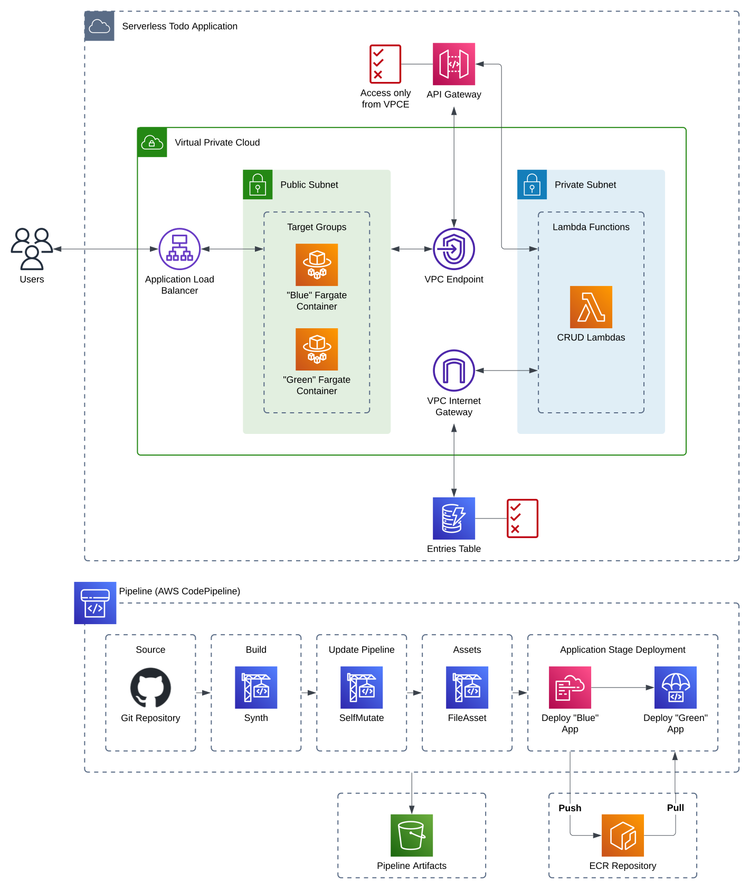

# serverless-todo

<p align="center">
  <picture>
    <source media="(prefers-color-scheme: dark)" srcset="./docs/assets/logos/serverless_todo_logo_label_dark.svg">
    
  </picture>
</p>

Serverless Todo is a simple web app for keeping track of the things you have... _to do_. Built entirely for the purpose of getting practice with Next.js, AWS CDK, Python, and a few DevOps / Systems Design concepts here and there.

> Is it perfect? Probably not! Tell me what I got right, what I got wrong - let's start a discussion!

---

## Table of Contents

- [Overview](#overview)
  - [Architecture](#architecture)
  - [Features](#features)
- [CICD](#cicd)
- [Ephemeral Environments](#ephemeral-environments)
- [Future Work](#future-work)

---

## Overview

### Architecture



### Features

## CICD

A CICD pipeline has been built using [CDK Pipelines](https://docs.aws.amazon.com/cdk/v2/guide/cdk_pipeline.html) and should be used to handle all deployments. Due to the scope of the project, automated deployments are currently only made to one AWS environment.

Please read the [Serverless Todo CICD Pipeline](/pipeline/README.md) document for information on usage and how to get started with development.

## Ephemeral Environments

During development, it may be helpful to spin up ephemeral environments; short-lived copies of the application stack that correspond to the feature being worked on.

A shell script has been written for this exact purpose! It acts as a wrapper to the `cdk deploy` command, meaning you can pass in the same command line options. Try `./scripts/deploy_ephemeral --hotswap`, or use a non-default AWS account using the `--profile` option!

Basic usage of the [deploy_ephemeral](./scripts/deploy_ephemeral) script looks like:

```bash
# Checkout a new branch e.g.
git checkout -B feature/user-accounts
# From the project root, run:
./scripts/deploy_ephemeral
```

This will synthesize new stateful and stateless stacks, creating AWS resources with the branch name added on as a prefix, e.g. `feature-user-accountsEntriesTable`.

## Future Work
