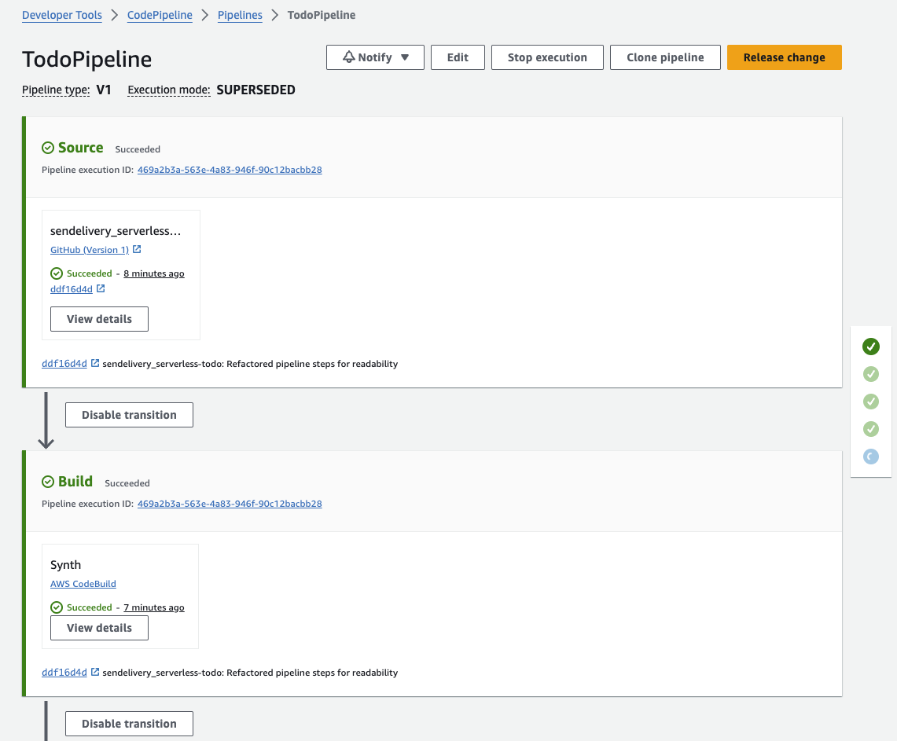
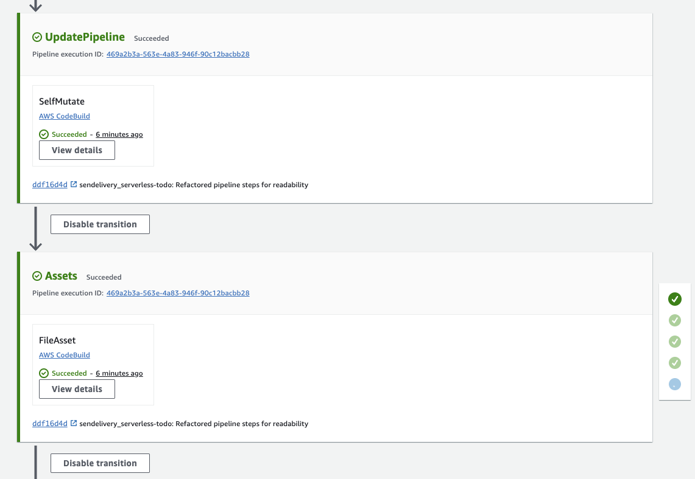
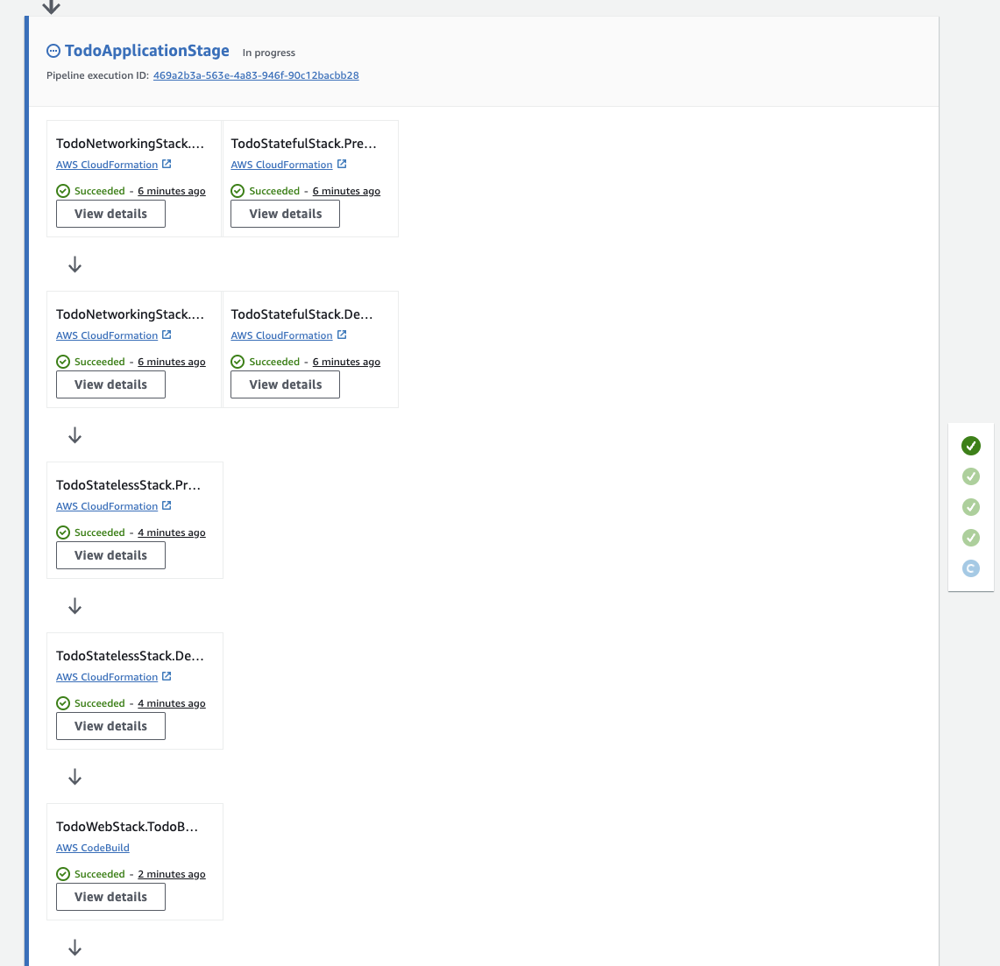
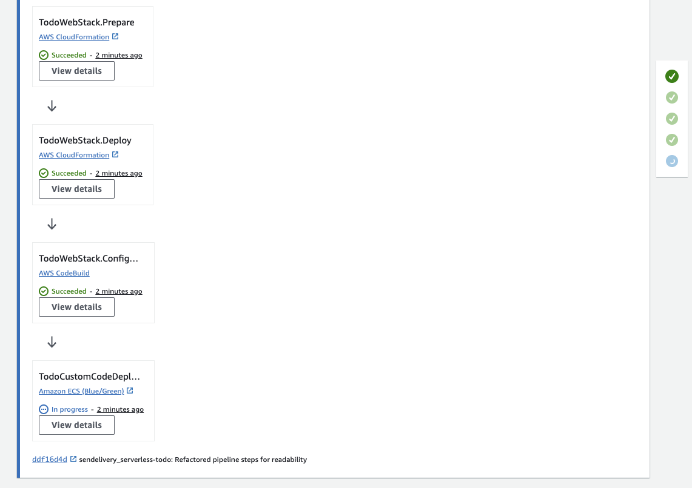
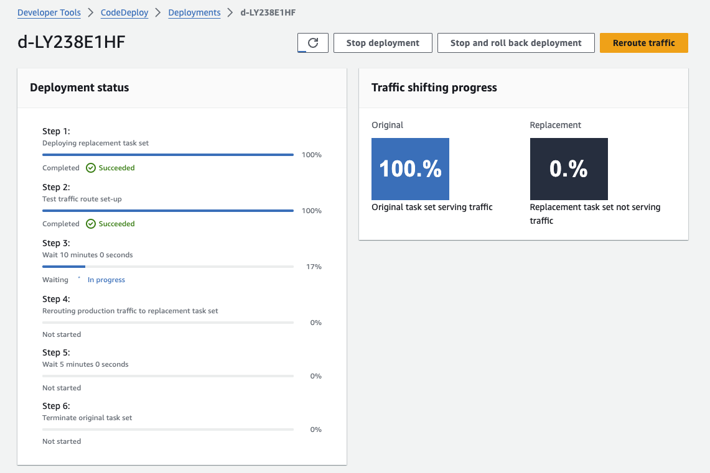
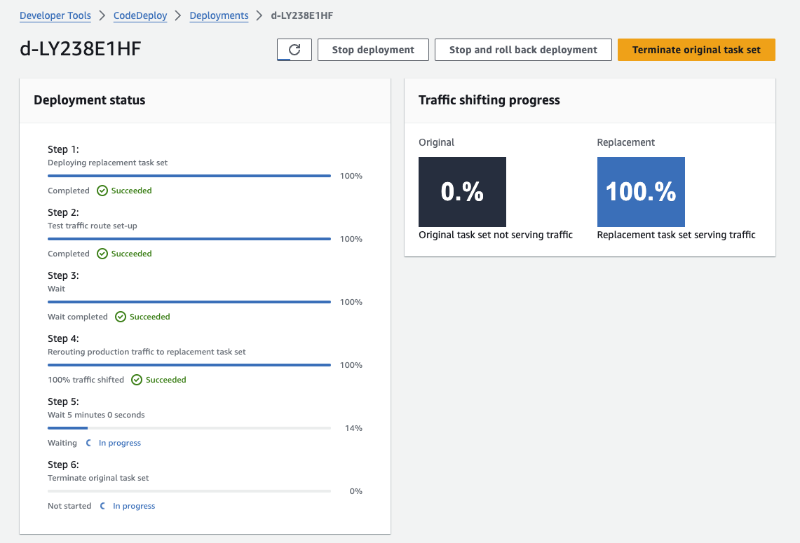
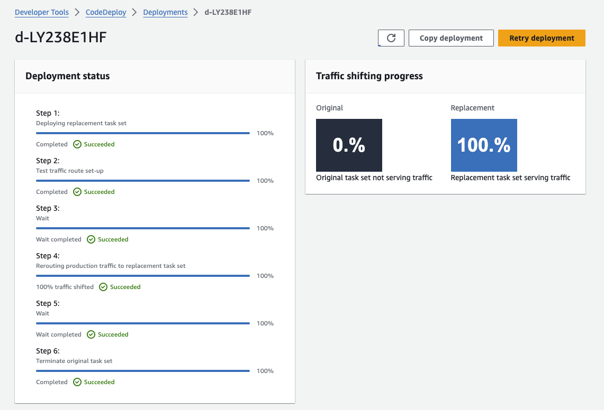

## Serverless Todo CICD Pipeline

- [Overview](#overview)
- [Getting Started](#getting-started)
- [Deployment Strategy](#deployment-strategy)
- [Custom Steps](#custom-steps)
- [In Action](#in-action)

### Overview

The project's CICD pipeline is powered by [CDK Pipelines](https://docs.aws.amazon.com/cdk/v2/guide/cdk_pipeline.html) and takes care of all automated deployments to the production environment.

The pipeline consists of the following:

- A _stage_, a logical grouping of an application's infrastructure, which is composed of all of our [application stacks](../application/). If there are dependencies between the stacks, the stacks are automatically added to the pipeline in the right order. Stacks that don't depend on each other are deployed in parallel.
- A number of custom steps required to handle automatically uploading the latest version of our web app to a container repository, and to configure a blue / green deployment of our application.

### Getting Started

To get started with deploying, simply run `cdk deploy` in the project root.

This command only needs to be run once, after which the pipeline will have been created in your AWS account. A CodePipeline execution will then automatically trigger, taking the source code from the remote repository's `main` branch. The application stacks will then be synthesised and deployed by the pipeline using CloudFormation and CodeDeploy.

Subsequent deployments can be performed simply by pushing commits (ideally as approved pull requests) to the `main` branch, each commit will trigger a new CodePipeline execution!

> When working on the pipeline itself, it may be useful to create a feature branch, and point the pipeline to that branch. That way you can pick up your latest changes automatically, and leverage CDK Pipeline's [SelfMutate](https://docs.aws.amazon.com/cdk/api/v2/docs/aws-cdk-lib.pipelines-readme.html#provisioning-the-pipeline) feature.

### Deployment Strategy

Deployments of the web tier follows a **Blue / Green deployment strategy** using AWS CodeDeploy. A "Green" instance of the web app will be spun up and become available to the internet for 10 minutes on port `8080` for manual approval. Once validated, CodeDeploy will shift 10% of the web traffic over to the Green instance, and wait another 5 minutes before rerouting the remaining 90% of the traffic.

The original "Blue" instance will be terminated 5 minutes after having completed the traffic shift. After which, the deployment and pipeline execution will have completed and marked successful.

### Custom Steps

A number of custom pipeline steps have been defined to undertake various tasks. These are described in the table below:

| Step Name                      | Description                                                                                                                                                                                                                                                                                                                                                                                                                                                                                       |
| ------------------------------ | ------------------------------------------------------------------------------------------------------------------------------------------------------------------------------------------------------------------------------------------------------------------------------------------------------------------------------------------------------------------------------------------------------------------------------------------------------------------------------------------------- |
| `BuildAndUploadDockerImage`    | A CodeBuild step that builds a standalone image of our [web application](../web/) using Docker, and uploads it to the ECR repository defined in our [stateful stack](../application/stateful/stateful_stack.py). To accomplish this, the CodeBuild step requires the IAM permissions to log into ECR and upload to the specified repository.  A [bash script](../scripts/pipeline/push_to_ecr) has also been written to aid in this goal and keep the pipeline code as concise as possible. |
| `ConfigureBlueGreenDeployment` | A CodeBuild step that generates files required by the `BlueGreenDeploymentStep`.  A [bash script](../scripts/codedeploy/configure_deploy_step) has been written for the same reasons as described above. See the script itself for more information on what it does.                                                                                                                                                                                                                        |
| `BlueGreenDeploymentStep`      | A CodeDeploy step that consumes the files generated in the `ConfigureBlueGreenDeployment` to correctly produce a "green" target group that is wired up to our web tier's load balancer.This step has been implemented as a subclass of the CDK Pipelines `Step` class and can be found [here](../pipeline/lib/bluegreen_deployment_step.py).  **Note:** This step requires manual approval, see the below section for more information.                                                     |

### In Action

Below is an example of the CICD pipeline in action. The important part to note is the section labelled _TodoApplicationStage_ which is where all of our application stacks are synthesised and our custom steps are run.

The final step, `TodoCustomCodeDeployStep`, is where the blue / green deployment of our application takes place. Clicking through to the link on this step takes the developer to the CodeDeploy job responsible for deployment of the "green" instance. This step requires manual approval, as described in the [Deployment Strategy](#deployment-strategy) section above.

> **Note:** the screenshots below are only illustrative, the actual pipeline may have evolved due to development work since the screenshots were taken.

#### Pipeline

  
  
  
  

#### Blue / Green Deploy Step

  
  
  

